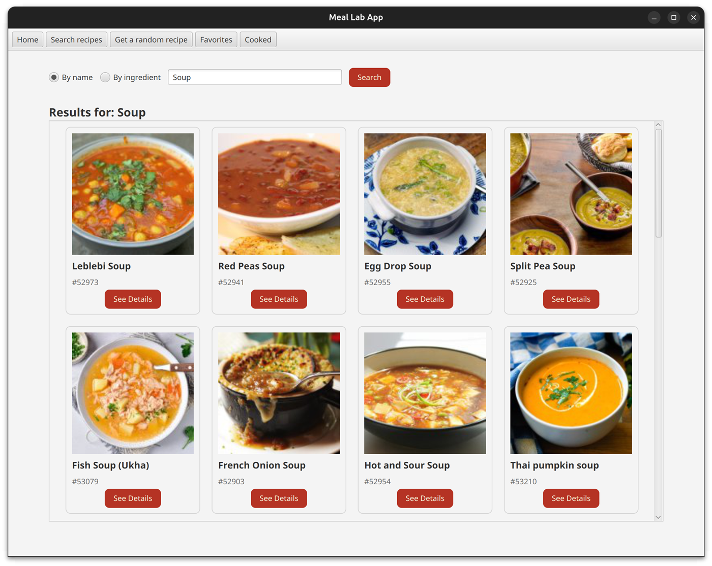
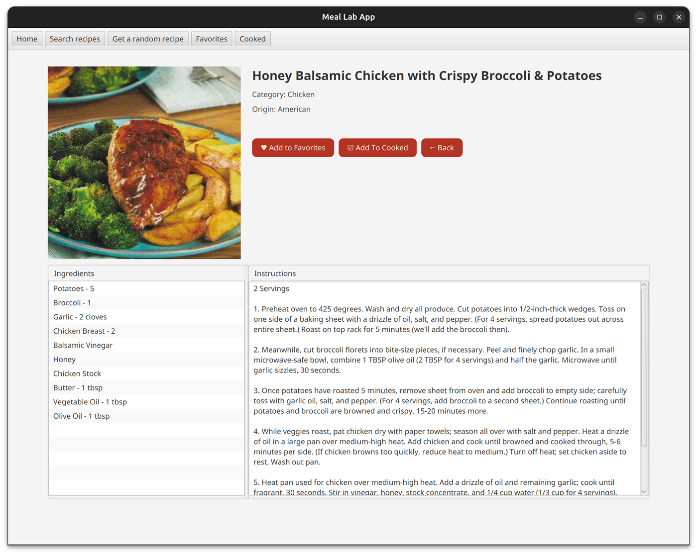
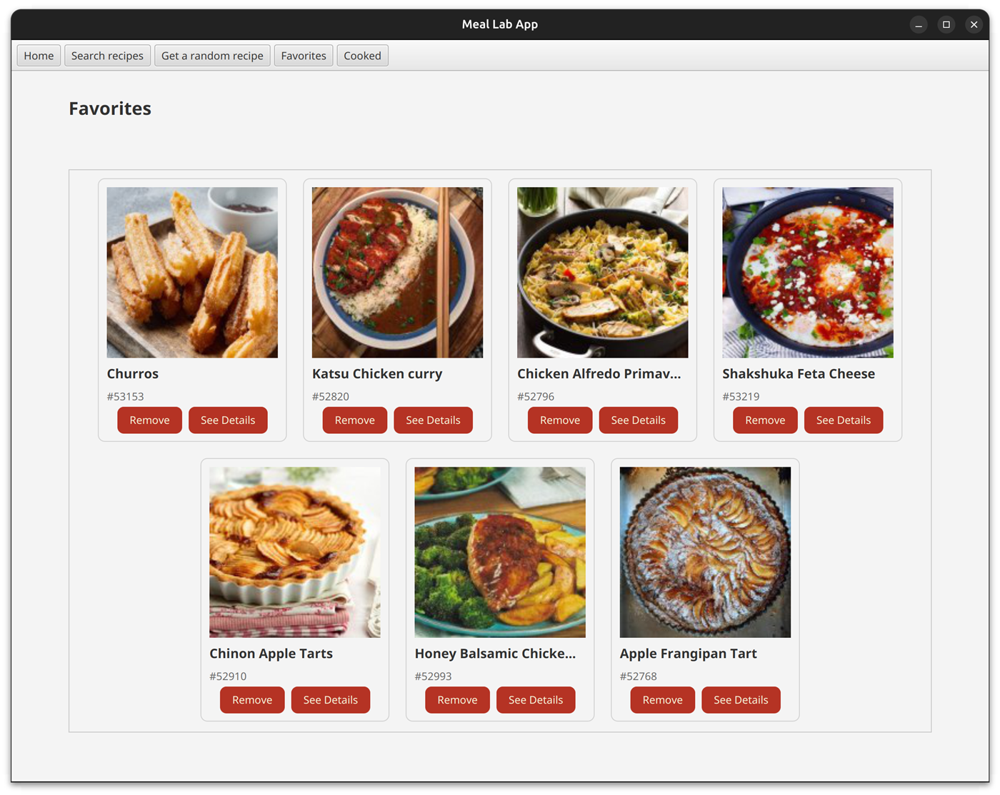

# Meal Lab

A JavaFX desktop client for searching recipes from [TheMealDB](https://www.themealdb.com/api.php) API, with support for saving favorite meals and tracking the ones you've cooked.



## Features

- Search recipes by name or by ingredient
- Get a random recipe
- View meal details: image, category, origin, ingredients and instructions
- Save meals to **Favorites** and mark them as **Cooked** (persisted locally between runs)
- Custom-styled UI (JavaFX CSS)

## Screenshots

| Meal details | Favorites |
| --- | --- |
|  |  |

## Project structure

- `meal-lab-api` – client library for TheMealDB (HTTP calls, models, error handling)
- `meal-lab-app` – JavaFX application (views, navigation, favorites/cooked managers)

## Getting started

### Prerequisites

- JDK 21+
- Maven 3.8+

### Build

The app depends on the API module, so install the API first:

```bash
cd meal-lab-api && mvn clean install
cd ../meal-lab-app && mvn clean install
```

### Test

```bash
cd meal-lab-api && mvn test
cd ../meal-lab-app && mvn test
```

### Run

```bash
cd meal-lab-app && mvn javafx:run
```

## Using Eclipse

<details>
<summary>Eclipse (embedded Maven) instructions</summary>

1. **Import:** `File` → `Import...` → `Maven` → `Existing Maven Projects`, select the repo root and finish.
2. **Use embedded Maven:** `Window` → `Preferences` → `Maven` → `Installations`, select `Embedded` and apply.
3. **Install API:** right-click `meal-lab-api` → `Run As` → `Maven build...`, Goals: `clean install`.
4. **Run tests:** right-click `meal-lab-api` (then `meal-lab-app`) → `Run As` → `Maven test`.
5. **Run UI:** right-click `meal-lab-app` → `Run As` → `Maven build...`, Goals: `javafx:run`.

</details>

## Credits

Recipe data and images are provided by [TheMealDB](https://www.themealdb.com/), used via its free public API.

## License

Released under the [MIT License](LICENSE). Recipe data and images remain the property of TheMealDB and its contributors.
